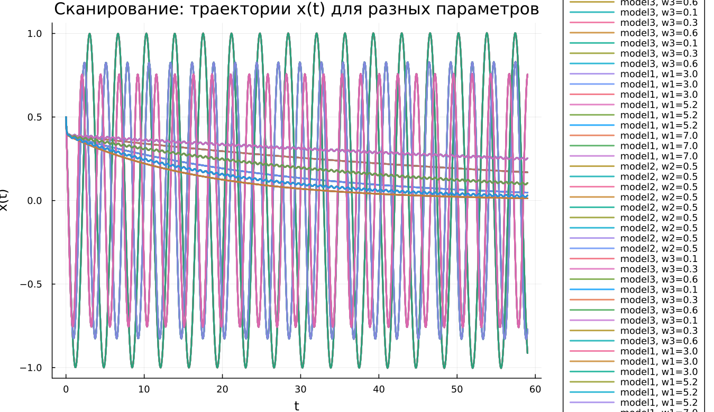
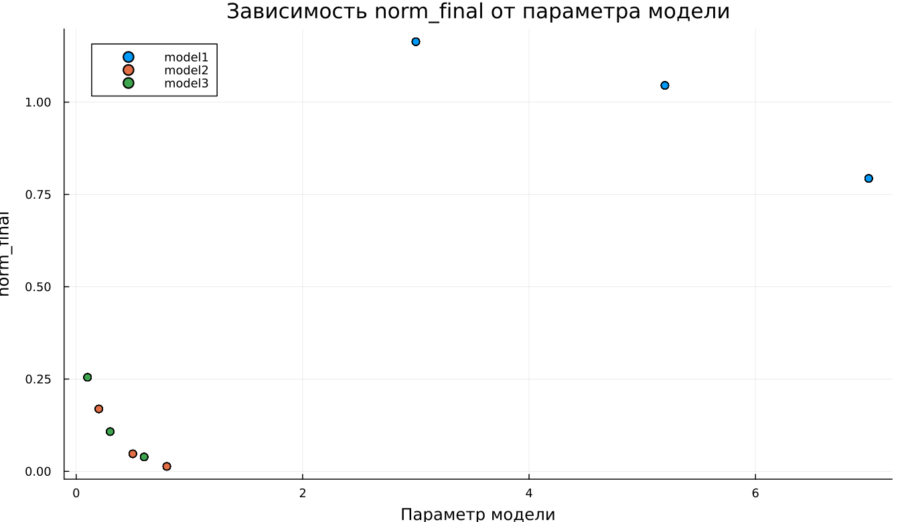

---
## Author
author:
  name: Чилеше Лупупа
  email: 1032225194@rudn.ru
  affiliation:
    - name: Российский университет дружбы народов
      country: Российская Федерация
      postal-code: 117198
      city: Москва
      address: ул. Миклухо-Маклая, д. 6

## Title
title: "Математическое моделирование"
subtitle: "Лабораторная работа № 4"
license: "CC BY"
date: today
date-format: "YYYY-MM-DD"
---

# Вводная часть

## Цель работы

Рассмотреть математическую модель гармонического осциллятора и проанализировать её динамику в трёх режимах:

1. без диссипации энергии;
2. при наличии затухания;
3. при воздействии внешней силы.

## Задание

1. Найти решение уравнения осциллятора без затухания.  
2. Получить уравнение затухающего движения и исследовать его решение.  
3. Построить фазовый портрет для затухающего режима.  
4. Рассмотреть систему с внешним воздействием.  
5. Проанализировать решение и фазовую структуру вынужденных колебаний.  

# Теоретические сведения

## Гармонический осциллятор

Гармонический осциллятор служит базовой моделью для описания колебательных процессов различной природы.

Общее уравнение:

$$
\ddot{x} + 2\gamma \dot{x} + \omega_0^2 x = F(t)
$$

где:

- $x$ — координата или состояние системы;  
- $\gamma$ — коэффициент затухания;  
- $\omega_0$ — собственная частота;  
- $F(t)$ — внешнее воздействие.  

## Система без потерь

В отсутствие затухания уравнение принимает вид:

$$
\ddot{x} + \omega_0^2 x = 0
$$

Такая система является консервативной: энергия сохраняется, а движение остаётся строго периодическим.

## Система с затуханием

При наличии потерь энергии:

$$
\ddot{x} + 2\gamma \dot{x} + \omega_0^2 x = 0
$$

Амплитуда уменьшается со временем, и система постепенно приходит к равновесию.

## Система с внешним воздействием

При добавлении внешней силы:

$$
\ddot{x} + 2\gamma \dot{x} + \omega_0^2 x = F(t)
$$

В этом случае формируются вынужденные колебания, поддерживаемые внешним источником энергии.

# Переход к системе первого порядка

## Без затухания

$$
\begin{cases}
\dot{x} = y \\
\dot{y} = -\omega_0^2 x
\end{cases}
$$

## С затуханием

$$
\begin{cases}
\dot{x} = y \\
\dot{y} = -2\gamma y - \omega_0^2 x
\end{cases}
$$

## С внешней силой

$$
\begin{cases}
\dot{x} = y \\
\dot{y} = F(t) - 2\gamma y - \omega_0^2 x
\end{cases}
$$

## Начальные условия

Во всех экспериментах использовались:

$$
x_0 = 0.5, \quad y_0 = -1.5
$$

Интервал моделирования:

$$
t \in [0; 59]
$$

Шаг интегрирования:

$$
h = 0.05
$$

# Постановка задачи

## Модель 1

$$
\ddot{x} + 5.2x = 0
$$

## Модель 2

$$
\ddot{x} + 14\dot{x} + 0.5x = 0
$$

## Модель 3

$$
\ddot{x} + 13\dot{x} + 0.3x = 0.8\sin(9t)
$$

# Базовые эксперименты

## Первая модель: решение

## Первая модель: фазовый портрет

## Первая модель: анализ

Полученные результаты демонстрируют устойчивые гармонические колебания.

Характерные признаки:

- амплитуда не изменяется со временем;  
- движение строго периодическое;  
- энергия сохраняется;  
- фазовая траектория замкнута.  

Модель описывает идеальный осциллятор без потерь.

## Вторая модель: решение

## Вторая модель: фазовый портрет

## Вторая модель: анализ

Здесь наблюдается быстрое подавление колебаний.

Основные особенности:

- величина быстро стремится к нулю;  
- переходный процесс кратковременный;  
- фазовая траектория сжимается к равновесию;  
- система стабилизируется.  

Модель отражает затухающую динамику.

## Третья модель: решение

## Третья модель: фазовый портрет

## Третья модель: анализ

После начального затухания устанавливается режим вынужденных колебаний.

Наблюдения:

- формируются устойчивые малые колебания;  
- движение поддерживается внешней силой;  
- система не приходит к нулю;  
- фазовый портрет ограничен областью около равновесия.  

Модель описывает вынужденный режим.

# Параметрическое исследование

## Траектории $x(t)$

## Анализ $x(t)$

Параметрическое варьирование показало:

- в первой модели изменяется частота колебаний;  
- во второй — скорость затухания;  
- в третьей — параметры установившегося режима.  

## Траектории $y(t)$

## Анализ $y(t)$

Аналогичные закономерности:

- устойчивые колебания без потерь;  
- быстрое затухание;  
- поддерживаемые внешней силой колебания.  

# Анализ вычислений

## Время вычислений

## Интерпретация

Сравнение показало:

- минимальные затраты у первой модели;  
- умеренные у второй;  
- максимальные у третьей.  

Во всех случаях вычисления остаются быстрыми.

# Анализ итоговой метрики

## Метрика

$$
\text{norm\_final} = \sqrt{x(t_{final})^2 + y(t_{final})^2}
$$

## Зависимость

## Интерпретация

Результаты:

- первая модель — значение остаётся значительным;  
- вторая — стремится к нулю;  
- третья — остаётся малым, но ненулевым.  

Метрика отражает характер установившегося режима.

# Итоги

## Выводы

1. Незатухающая система сохраняет амплитуду и периодичность.  
2. Затухающая система быстро достигает равновесия.  
3. При внешнем воздействии возникают устойчивые вынужденные колебания.  
4. Параметры существенно влияют на динамику.  
5. Численное моделирование эффективно.  
6. Метрика $\text{norm\_final}$ подтверждает различия режимов.
