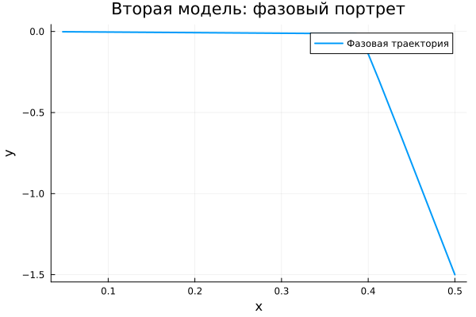
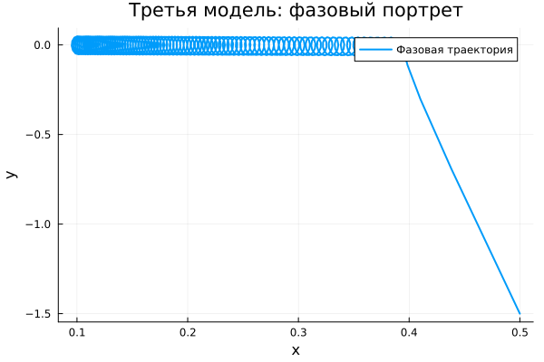
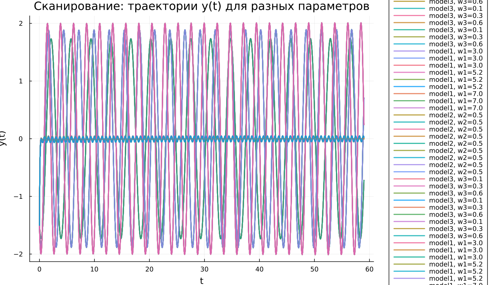

---
## Author
author:
  name: Чилеше Лупупа
  email: 1032225194@rudn.ru
  affiliation:
    - name: Российский университет дружбы народов
      country: Российская Федерация
      postal-code: 117198
      city: Москва
      address: ул. Миклухо-Маклая, д. 6

## Title
title: "Математическое моделирование"
subtitle: "Лабораторная работа № 4"
license: "CC BY"
---

# Цель работы

Освоить математическое описание и поведение гармонического осциллятора.

# Задание

1. Построить решение уравнения гармонического осциллятора без учета затухания  
2. Получить и исследовать уравнение затухающего осциллятора, а также построить его фазовый портрет  
3. Рассмотреть осциллятор под действием внешней силы, найти решение и изобразить фазовый портрет  

# Выполнение лабораторной работы

## Теоретические сведения

Множество физических процессов — от механических колебаний до электрических цепей — могут быть описаны единым математическим аппаратом. В основе лежит модель линейного гармонического осциллятора, задаваемая дифференциальным уравнением второго порядка:

$$
\ddot{x} + 2\gamma \dot{x} + \omega_0^2 x = 0
$$

Здесь $x$ характеризует состояние системы, $\gamma$ отражает уровень диссипации энергии, а $\omega_0$ задаёт собственную частоту.

Если потери отсутствуют ($\gamma = 0$), модель упрощается до:

$$
\ddot{x} + \omega_0^2 x = 0
$$

Для получения однозначного решения необходимо задать начальные условия:

$$
\begin{cases}
x(t_0) = x_0 \\
\dot{x}(t_0) = y_0
\end{cases}
$$

Эквивалентная форма в виде системы первого порядка:

$$
\begin{cases}
\dot{x} = y \\
\dot{y} = -\omega_0^2 x
\end{cases}
$$

Соответствующие начальные условия:

$$
\begin{cases}
x(t_0) = x_0 \\
y(t_0) = y_0
\end{cases}
$$

Пара переменных $x$ и $y$ формирует фазовое пространство. Траектория системы в этом пространстве описывает её эволюцию. Совокупность таких траекторий образует фазовый портрет, позволяющий визуально оценить динамику.

## Задача

Построить решения и фазовые портреты для следующих случаев:

1. Без затухания:
   $$
   \ddot{x} + 5.2x = 0
   $$

2. С затуханием:
   $$
   \ddot{x} + 14\dot{x} + 0.5x = 0
   $$

3. С затуханием и внешним воздействием:
   $$
   \ddot{x} + 13\dot{x} + 0.3x = 0.8\sin(9t)
   $$

Параметры:
$t \in [0; 59]$, шаг $0.05$, $x_0 = 0.5$, $y_0 = -1.5$

### Преобразование моделей

1. Без затухания:

$$
\begin{cases}
\dot{x} = y \\
\dot{y} = -\omega_0^2 x
\end{cases}
$$

2. С затуханием:

$$
\begin{cases}
\dot{x} = y \\
\dot{y} = -2\gamma y - \omega_0^2 x
\end{cases}
$$

3. С внешней силой:

$$
\begin{cases}
\dot{x} = y \\
\dot{y} = F(t) - 2\gamma y - \omega_0^2 x
\end{cases}
$$

Для численного моделирования использовались внешние программные модули:





## Базовые эксперименты

### Первая модель (model_type = model1)

График $y(t)$ демонстрирует устойчивые периодические колебания без изменения амплитуды. Система сохраняет энергию, что подтверждает отсутствие затухания.

Фазовая траектория представляет собой замкнутую кривую, указывающую на регулярное повторение движения.

Таким образом, модель описывает идеальные колебания без потерь.

### Вторая модель (model_type = model2)

Здесь наблюдается быстрое затухание: амплитуда резко уменьшается, и система стремится к равновесию.

Фазовый портрет показывает сжатие траектории к точке покоя, что отражает потерю энергии.

Модель иллюстрирует апериодический переход к устойчивому состоянию.

### Третья модель (model_type = model3)

После начального затухания система выходит на режим устойчивых колебаний, поддерживаемых внешней силой.

Амплитуда мала, но сохраняется за счёт постоянного воздействия.

Фазовый портрет ограничен небольшой областью около равновесия.

Модель демонстрирует вынужденные колебания.

## Параметрическое сканирование

### Траектории $x(t)$

Изменение параметров влияет следующим образом:

- в первой модели — на частоту;
- во второй — на скорость затухания;
- в третьей — на режим вынужденных колебаний.

Общее поведение:

- первая модель остаётся колебательной;
- вторая стремится к покою;
- третья стабилизируется на вынужденных колебаниях.

### Траектории $y(t)$

Картина аналогична:

- устойчивые колебания в первой модели;
- быстрое затухание во второй;
- поддерживаемые внешней силой колебания в третьей.

## Время вычислений

Результаты показывают:

- минимальное время у первой модели;
- умеренное — у второй;
- максимальное — у третьей.

Тем не менее, вычисления во всех случаях выполняются быстро.

## Анализ метрики norm_final

Рассматривается величина:

$$
\text{norm\_final} = \sqrt{x(t_{final})^2 + y(t_{final})^2}
$$

Наблюдения:

- первая модель — значение остаётся значительным;
- вторая — стремится к нулю;
- третья — принимает малое, но ненулевое значение.

# Выводы

1. Незатухающая модель сохраняет амплитуду колебаний  
2. Затухающая модель быстро приходит к равновесию  
3. При наличии внешней силы возникают устойчивые вынужденные колебания  
4. Параметры существенно влияют на динамику системы  
5. Численные расчёты выполняются эффективно  
6. Метрика $\text{norm\_final}$ отражает характер поведения моделей  

# Список литературы {.unnumbered}

1. [Гармонический осциллятор](https://ru.wikipedia.org/wiki/Гармонический_осциллятор)  
2. [Модели колебательных систем](https://www.numamo.org/HTML/Articles/Oscillator.html)
