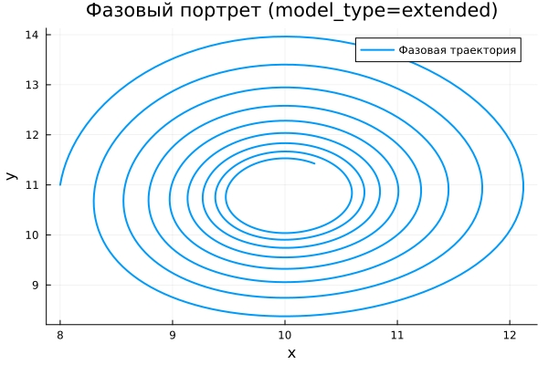

---
## Author
author:
  name: Чилеше Лупупа
  email: 1032225194@rudn.ru
  affiliation:
    - name: Российский университет дружбы народов
      country: Российская Федерация
      postal-code: 117198
      city: Москва
      address: ул. Миклухо-Маклая, д. 6

## Title
title: "Математическое моделирование"
subtitle: "Лабораторная работа № 5"
license: "CC BY"
date: today
date-format: "YYYY-MM-DD"
---

# Вводная часть

## Цель работы

Рассмотреть модель взаимодействия «хищник–жертва» и провести анализ её поведения как в классической, так и в модифицированной постановке.

## Задание

1. Построить зависимость численности хищников от численности жертв.  
2. Построить временные графики $x(t)$ и $y(t)$.  
3. Определить стационарное состояние.  
4. Сопоставить поведение базовой и расширенной моделей.  
5. Выполнить исследование влияния параметров.  

# Теоретические сведения

## Модель хищник-жертва

Исследуется система Лотки–Вольтерры, описывающая динамику двух взаимодействующих популяций.

Обозначим:

- $x(t)$ — численность хищников;  
- $y(t)$ — численность жертв.  

Тогда модель задаётся системой:

$$
\begin{cases}
\frac{dx}{dt} = -a x(t) + b x(t)y(t), \\
\frac{dy}{dt} = c y(t) - d x(t)y(t).
\end{cases}
$$

## Интерпретация параметров

Параметры модели имеют следующий смысл:

- $a$ — интенсивность убыли хищников;  
- $b$ — прирост хищников за счёт взаимодействия;  
- $c$ — естественный рост жертв;  
- $d$ — уменьшение численности жертв из-за хищников.  

Изменение этих коэффициентов приводит к различным типам динамики.

## Стационарное состояние

Равновесие системы определяется условиями:

$$
\frac{dx}{dt}=0, \qquad \frac{dy}{dt}=0
$$

При положительных значениях переменных получаем:

$$
x_0=\frac{a}{b}, \qquad y_0=\frac{c}{d}
$$

В этой точке система находится в состоянии динамического баланса.

# Постановка задачи

## Исследуемая система

Рассматривается система:

$$
\begin{cases}
\frac{dx}{dt} = -0.25x(t) + 0.025x(t)y(t), \\
\frac{dy}{dt} = 0.45y(t) - 0.045x(t)y(t).
\end{cases}
$$

## Начальные условия

Заданы:

$$
x_0 = 8, \qquad y_0 = 11
$$

## Стационарное состояние системы

Вычисление даёт:

$$
x_0 = 10, \qquad y_0 = 10
$$

Таким образом, точка равновесия:

$$
(10, 10)
$$

# Базовые эксперименты

## Базовая модель: временные зависимости

## Базовая модель: фазовый портрет

## Базовая модель: анализ

В базовом случае система демонстрирует регулярные колебания.

Ключевые особенности:

- динамика носит периодический характер;  
- амплитуда колебаний практически не меняется;  
- отсутствует стремление к равновесию;  
- фазовая траектория является замкнутой.  

Это соответствует классическому автоколебательному режиму.

## Расширенная модель: временные зависимости

## Расширенная модель: фазовый портрет

## Расширенная модель: анализ

Добавление нелинейного члена изменяет динамику системы.

Наблюдается:

- уменьшение амплитуды со временем;  
- постепенное подавление колебаний;  
- выход на устойчивое состояние;  
- фазовая траектория имеет спиральный вид.  

Следовательно, система становится асимптотически устойчивой.

# Параметрическое исследование

## Сканирование траекторий $x(t)$

## Анализ траекторий $x(t)$

Проведено варьирование параметров моделей.

Результаты:

- в базовой модели изменение $a$ влияет на форму колебаний;  
- сохраняется периодический режим;  
- в расширенной модели параметр $k$ определяет скорость затухания;  
- увеличение $k$ ускоряет стабилизацию.  

## Сканирование траекторий $y(t)$

## Анализ траекторий $y(t)$

Поведение аналогично:

- базовая модель — устойчивые колебания;  
- расширенная модель — затухающие процессы;  
- усиление нелинейности ускоряет выход на равновесие.  

## Фазовые траектории

## Анализ фазовых траекторий

Фазовые диаграммы показывают:

- замкнутые кривые для базовой модели;  
- спиральное приближение к равновесию для расширенной;  
- различие между консервативной и диссипативной динамикой.  

# Анализ итоговой метрики

## Метрика norm_final

Рассматривается величина:

$$
\text{norm\_final} = \sqrt{x(t_{final})^2 + y(t_{final})^2}
$$

## Зависимость norm_final от параметра

## Интерпретация результата

Результаты показывают:

- для базовой модели значение остаётся значительным из-за непрерывных колебаний;  
- для расширенной модели оно определяется положением равновесия;  
- после переходного процесса система стабилизируется.  

Метрика позволяет различать тип поведения системы.

# Анализ вычислений

## Время вычислений

## Интерпретация времени вычислений

Численные эксперименты показывают:

- высокая скорость расчётов;  
- слабая зависимость времени от параметров;  
- отсутствие значительного усложнения при добавлении нелинейности.  

Таким образом, алгоритм численного решения остаётся эффективным.

# Итоги

## Выводы

1. Базовая модель реализует незатухающие периодические колебания.  
2. Расширенная модель приводит к затухающей динамике и устойчивому состоянию.  
3. Фазовые портреты отражают различие между замкнутыми и сходящимися траекториями.  
4. Параметры управляют характеристиками колебаний и переходных процессов.  
5. Метрика $\text{norm\_final}$ позволяет оценить тип режима.  
6. Численные методы демонстрируют высокую эффективность для обеих моделей.  
