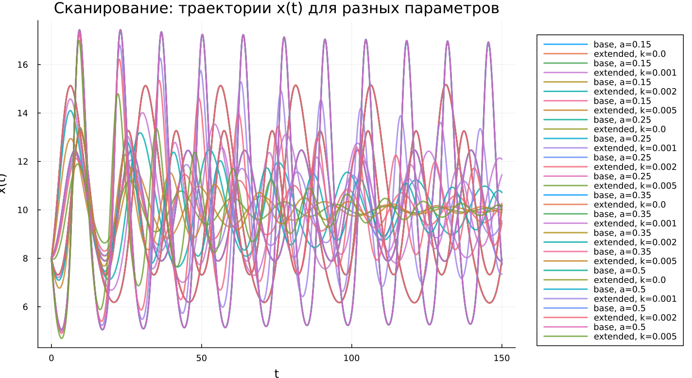

---
## Author
author:
  name: Чилеше Лупупа
  email: 1032225194@rudn.ru
  affiliation:
    - name: Российский университет дружбы народов
      country: Российская Федерация
      postal-code: 117198
      city: Москва
      address: ул. Миклухо-Маклая, д. 6

## Title
title: "Математическое моделирование"
subtitle: "Лабораторная работа № 5"
license: "CC BY"
---

# Цель работы

Освоить математическое описание системы типа «хищник–жертва» и проанализировать её динамические свойства

# Задание

1. Построить фазовую зависимость $x(y)$, а также временные графики $x(t)$ и $y(t)$  
2. Определить стационарное состояние рассматриваемой системы  

# Выполнение лабораторной работы

## Теоретические сведения

В рамках данной работы исследуется классическая модель взаимодействия двух популяций — хищников и жертв.

Обозначим численности популяций через $X$ (хищники) и $Y$ (жертвы). Предполагается выполнение следующих условий (модель Лотки–Вольтерры):

1. Численности популяций зависят исключительно от времени  
2. При отсутствии взаимодействия динамика описывается экспоненциальными законами: жертвы увеличиваются, хищники сокращаются  
3. Влияние естественной смертности жертв и рождаемости хищников пренебрежимо мало  
4. Ограниченность ресурсов не учитывается  
5. Взаимодействие между видами влияет на скорость изменения их численностей  

Математическая модель имеет вид:

$$
\begin{cases}
\frac{dx}{dt} = -a x(t) + b x(t) y(t) \\
\frac{dy}{dt} = c y(t) - d x(t) y(t)
\end{cases}
$$

где коэффициенты $a, b, c, d$ задают интенсивности взаимодействия и естественные темпы изменения популяций.

Особое значение имеет стационарное состояние системы, при котором изменения отсутствуют:

$$
\frac{dx}{dt} = 0, \quad \frac{dy}{dt} = 0
$$

При условии $x > 0$, $y > 0$ получаем:

$$
x_0 = \frac{a}{b}, \quad y_0 = \frac{c}{d}
$$

## Задача

Рассмотрим конкретную систему:

$$
\begin{cases}
\frac{dx}{dt} = -0.25x(t) + 0.025x(t)y(t) \\
\frac{dy}{dt} = 0.45y(t) - 0.045x(t)y(t)
\end{cases}
$$

Необходимо:

- построить зависимости $x(t)$, $y(t)$ и фазовый портрет  
- исследовать поведение системы при начальных условиях $x_0 = 8$, $y_0 = 11$  
- определить стационарную точку  

Стационарное состояние:

$$
x_0 = 10, \quad y_0 = 10
$$

Для численного решения и визуализации использовались внешние модули:





## Базовые эксперименты

### Базовая модель (model_type = base)

Во временных зависимостях наблюдаются регулярные колебания обеих переменных. Численности $x(t)$ и $y(t)$ изменяются циклически, причём величина амплитуды практически не меняется со временем.

Подобное поведение отражает классическую динамику без затухания. Система не стремится к равновесию, а остаётся в режиме постоянных колебаний.

Фазовый портрет представляет собой замкнутую траекторию, что свидетельствует о периодичности и ограниченности движения в фазовом пространстве.

### Расширенная модель (model_type = extended)

В данной модификации также наблюдаются колебания, однако их характер изменяется: амплитуда постепенно уменьшается.

Причина заключается во введении дополнительного члена $-k x^2$, который ограничивает рост популяции жертв. Это приводит к потере консервативности системы.

Со временем колебания затухают, а решение стремится к устойчивому состоянию.

Фазовый портрет имеет форму спирали, сходящейся к равновесной точке, что подтверждает наличие устойчивого режима.

## Параметрическое сканирование

### Траектории $x(t)$ для различных параметров

Проведено исследование влияния параметров:

- в базовой модели варьировался коэффициент $a$  
- в расширенной — параметр $k$  

Для базовой модели изменение $a$ влияет на форму колебаний: меняются частота и амплитуда, но режим остаётся периодическим.

В расширенной модели увеличение $k$ ускоряет затухание и приводит к более быстрому выходу на устойчивое состояние.

Основные выводы:

- базовая модель сохраняет автоколебательный режим  
- расширенная демонстрирует затухание  
- параметры регулируют характеристики переходного процесса  

### Траектории $y(t)$ для различных параметров

Поведение переменной $y(t)$ аналогично:

- в базовой модели сохраняется периодичность  
- в расширенной наблюдается снижение амплитуды и переход к стационарному уровню  

Усиление нелинейного эффекта ускоряет стабилизацию системы.

### Фазовые траектории для различных параметров

Фазовые диаграммы наглядно демонстрируют различие динамики:

- базовая модель — замкнутые траектории  
- расширенная — спиральное приближение к равновесию  

Это подтверждает различную природу моделей: колебательную и стабилизирующуюся соответственно.

## Анализ метрики norm_final

Используется метрика:

$$
\text{norm\_final} = \sqrt{x(t_{final})^2 + y(t_{final})^2}
$$

Для базовой модели значение остаётся значительным, так как система не достигает равновесия.

В расширенной модели метрика отражает положение устойчивого состояния, к которому стремится система.

## Время вычислений

Численные эксперименты показывают, что время расчётов остаётся малым для обеих моделей.

Изменение параметров $a$ и $k$ оказывает незначительное влияние на вычислительные затраты.

Добавление нелинейного члена не приводит к существенному усложнению вычислений.

## Выводы

1. Базовая модель характеризуется устойчивыми периодическими колебаниями без затухания  
2. Расширенная модель приводит к затухающему режиму и устойчивому равновесию  
3. Фазовые портреты демонстрируют принципиальные различия динамики  
4. Параметры $a$ и $k$ управляют характеристиками колебаний и скоростью стабилизации  
5. Метрика $\text{norm\_final}$ позволяет различать типы поведения системы  
6. Обе модели эффективно решаются численно без существенных затрат ресурсов  

# Список литературы {.unnumbered}

1. [Модель Лотки-Вольтерры](https://math-it.petrsu.ru/users/semenova/MathECO/Lections/Lotka_Volterra.pdf)
2. [Lotka-Volterra System](https://www.sciencedirect.com/topics/mathematics/lotka-volterra-system)
