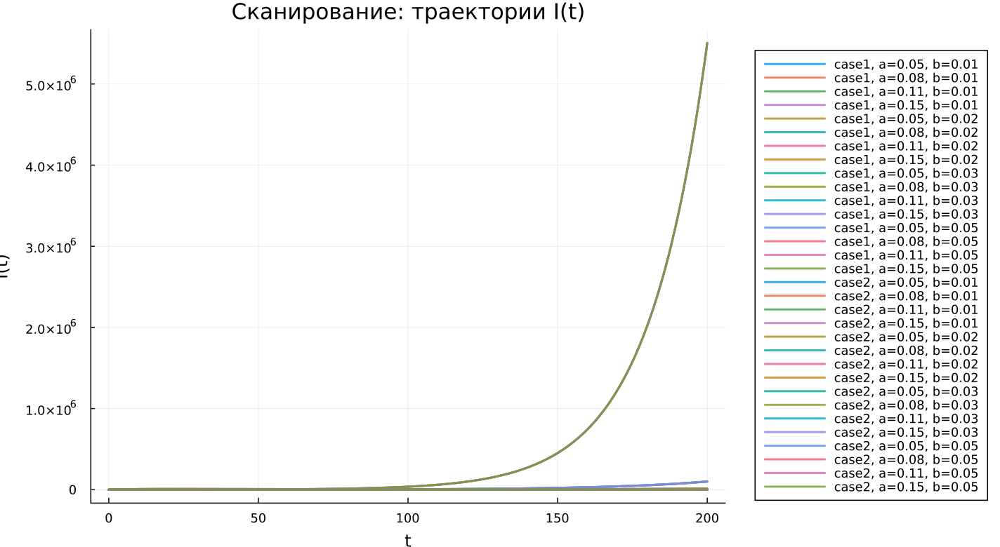

---
author:
  name: Чилеше Лупупа
  email: 1032225194@rudn.ru
  affiliation:
    - name: Российский университет дружбы народов
      country: Российская Федерация
      city: Москва
title: "Математическое моделирование"
subtitle: "Лабораторная работа № 6"
license: "CC BY"
date: today
date-format: "YYYY-MM-DD"
---

# Вводная часть

## Цель работы

Рассмотреть эпидемиологическую модель SIR и исследовать, как изменяется численность групп населения при распространении заболевания.

## Задание

1. Изучить математическую модель эпидемии.
2. Построить графики изменения групп $S(t)$, $I(t)$ и $R(t)$.
3. Проанализировать два режима:
   - $I(0) \leq I^*$;
   - $I(0) > I^*$.
4. Провести параметрическое исследование.
5. Сравнить полученные модели по графикам и численным метрикам.

# Теоретические сведения

## Модель SIR

В модели SIR вся популяция разделяется на три группы:

- $S(t)$ — восприимчивые к заболеванию;
- $I(t)$ — инфицированные и распространяющие инфекцию;
- $R(t)$ — выздоровевшие особи с иммунитетом.

Суммарная численность популяции задаётся выражением:

$$
N = S(t) + I(t) + R(t).
$$

## Смысл модели

Модель описывает последовательный переход особей между группами:

$$
S \rightarrow I \rightarrow R.
$$

Сначала здоровые восприимчивые особи заражаются и переходят в группу $I$. Затем инфицированные выздоравливают и попадают в группу $R$.

## Условие изоляции

Пока число заболевших не превышает критический уровень $I^*$, считается, что инфицированные изолированы.

Если выполняется условие

$$
I(t) \leq I^*,
$$

то новые заражения не происходят.

Если же

$$
I(t) > I^*,
$$

то инфицированные начинают заражать восприимчивых особей.

## Уравнение для $S(t)$

Изменение числа восприимчивых описывается системой:

$$
\frac{dS}{dt} =
\begin{cases}
-\alpha S, & I(t) > I^*, \\
0, & I(t) \leq I^*.
\end{cases}
$$

## Уравнение для $I(t)$

Динамика инфицированных определяется разностью между новыми заражениями и выздоровлениями:

$$
\frac{dI}{dt} =
\begin{cases}
\alpha S - \beta I, & I(t) > I^*, \\
-\beta I, & I(t) \leq I^*.
\end{cases}
$$

## Уравнение для $R(t)$

Число выздоровевших изменяется по формуле:

$$
\frac{dR}{dt} = \beta I.
$$

Параметры модели имеют следующий смысл:

- $\alpha$ — коэффициент заражения;
- $\beta$ — коэффициент выздоровления.

# Постановка задачи

## Исходные данные

На острове началось распространение эпидемии.

Заданы следующие начальные данные:

$$
N = 11400,
$$

$$
I(0) = 250,
$$

$$
R(0) = 47.
$$

## Начальное число восприимчивых

Количество восприимчивых людей в начальный момент времени определяется как разность между общей численностью населения, числом инфицированных и числом людей с иммунитетом:

$$
S(0) = N - I(0) - R(0).
$$

После подстановки исходных значений получаем:

$$
S(0) = 11400 - 250 - 47 = 11103.
$$

## Рассматриваемые случаи

В работе исследуются два варианта развития процесса:

1. $I(0) \leq I^*$ — начальное число инфицированных не превышает критический уровень.
2. $I(0) > I^*$ — начальное число инфицированных больше критического уровня.

# Базовые эксперименты

## Первая модель: временные зависимости

## Первая модель: фазовый портрет

## Анализ первой модели

В первой модели наблюдается поведение, нетипичное для классической SIR-системы:

- $S(t)$ остаётся неизменным;
- $I(t)$ возрастает по экспоненциальному закону;
- $R(t)$ уменьшается и может принимать отрицательные значения;
- в системе отсутствует механизм ограничения роста инфицированных.

## Вывод по первой модели

Первая модель нарушает физический смысл эпидемиологического процесса.

Главное противоречие состоит в том, что

$$
S(t) = const,
$$

поэтому запас восприимчивых не расходуется, а число инфицированных продолжает расти без естественного ограничения.

# Вторая модель

## Вторая модель: временные зависимости

## Вторая модель: фазовый портрет

## Анализ второй модели

Во второй модели формируется более реалистичная эпидемическая динамика:

- $S(t)$ монотонно уменьшается;
- $I(t)$ сначала растёт;
- после достижения максимума $I(t)$ начинает снижаться;
- $R(t)$ постепенно увеличивается.

## Интерпретация второй модели

На начальном этапе инфекция распространяется активно, так как число восприимчивых достаточно велико.

Затем количество восприимчивых уменьшается, скорость новых заражений падает, и эпидемия затухает:

$$
I(t) \rightarrow 0.
$$

# Сравнение базовых моделей

## Качественное различие

| Характеристика | Первая модель | Вторая модель |
|---|---|---|
| $S(t)$ | остаётся постоянным | монотонно убывает |
| $I(t)$ | растёт без ограничения | имеет конечный максимум |
| $R(t)$ | может становиться отрицательным | возрастает |
| Фазовый портрет | вертикальная траектория | незамкнутая кривая |
| Физический смысл | нарушается | сохраняется |

# Параметрическое исследование

## Сканирование траекторий $S(t)$

## Анализ траекторий $S(t)$

Для первой модели:

- значение $S(t)$ не меняется;
- изменение параметров почти не отражается на группе восприимчивых.

Для второй модели:

- $S(t)$ постепенно убывает;
- при увеличении параметра $a$ уменьшение происходит быстрее.

## Сканирование траекторий $I(t)$

## Анализ траекторий $I(t)$

Первая модель:

- показывает экспоненциальный рост $I(t)$;
- увеличение параметра $b$ ускоряет рост инфицированных.

Вторая модель:

- описывает эпидемическую волну;
- $I(t)$ достигает пика, после чего уменьшается.

## Сканирование траекторий $R(t)$

## Анализ траекторий $R(t)$

Первая модель:

- приводит к значениям $R(t)$, не имеющим физического смысла;
- допускает отрицательное число выздоровевших.

Вторая модель:

- отражает накопление выздоровевших;
- $R(t)$ стремится к конечному предельному значению.

## Фазовые траектории

## Анализ фазовых траекторий

Фазовые портреты подтверждают качественное различие между моделями:

- в первой модели траектории вырождаются в вертикальные линии;
- во второй модели траектории имеют типичную для SIR-системы форму;
- сначала $I$ растёт при уменьшении $S$;
- затем $I$ снижается, и эпидемия затухает.

# Анализ итоговых метрик

## Метрика norm_final

Для сравнения конечных состояний использовалась метрика:

$$
\text{norm\_final} =
\sqrt{
S(t_{final})^2 +
I(t_{final})^2 +
R(t_{final})^2
}.
$$

Она позволяет оценить состояние системы в конце численного моделирования.

## Зависимость norm_final от параметра

## Интерпретация norm_final

Для первой модели:

- значение метрики быстро увеличивается;
- основной причиной является экспоненциальный рост $I(t)$.

Для второй модели:

- значения метрики остаются меньше;
- система выходит к стационарному состоянию.

# Максимум инфицированных

## Зависимость $I_{max}$ от параметра

## Анализ $I_{max}$

Первая модель:

- даёт очень большие значения $I_{max}$;
- рост инфицированных не имеет естественного ограничения.

Вторая модель:

- формирует конечный максимум;
- величина пика зависит от параметра $a$;
- при большем $a$ максимум достигается быстрее.

# Анализ вычислений

## Время вычислений

## Интерпретация времени вычислений

Результаты бенчмаркинга показывают:

- обе модели численно решаются быстро;
- время вычислений имеет порядок $10^{-4}$ секунды;
- изменение параметров почти не влияет на вычислительную сложность;
- используемый численный метод работает эффективно.

# Итоги

## Основные результаты

1. Первая модель показывает нефизичное поведение.
2. В case1 число инфицированных растёт без ограничения.
3. Вторая модель описывает реалистичную эпидемическую волну.
4. В case2 эпидемия постепенно затухает, а $I(t) \to 0$.
5. Фазовые портреты подтверждают принципиальное различие моделей.

## Выводы

1. Модель case1 нельзя считать адекватной для описания эпидемии.
2. Модель case2 соответствует логике классического SIR-процесса.
3. Параметры $a$ и $b$ влияют на скорость распространения и затухания инфекции.
4. Метрики $\text{norm\_final}$ и $I_{max}$ позволяют количественно сравнить поведение моделей.
5. Численное решение обеих систем выполняется эффективно.

# Список литературы {.unnumbered}

1. [Конструирование эпидемиологических моделей](https://habr.com/ru/post/551682/)
2. [Зараза, гостья наша](https://nplus1.ru/material/2019/12/26/epidemic-math)
